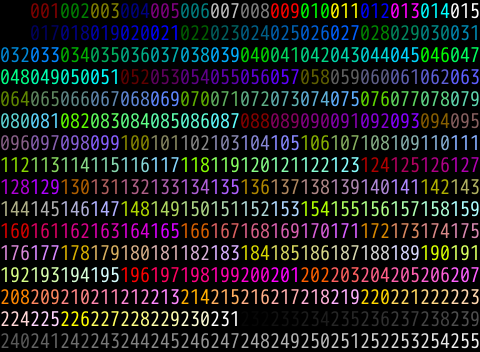
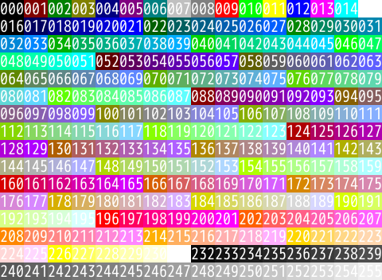

# textimg


[](https://codecov.io/gh/jiro4989/textimg)

textimgは端末上の着色されたテキスト(ANSIまたは256色)を画像に変換するコマンドです。
エスケープシーケンスを解釈して色を画像に再現します。

* [README (英語)](./README.md)

Table of contents:

<!--ts-->
   * [textimg](#textimg)
      * [使用例](#使用例)
         * [シンプルな使い方](#シンプルな使い方)
         * [虹色に出力する例](#虹色に出力する例)
            * [ANSIカラー](#ansiカラー)
            * [256色指定](#256色指定)
            * [RGB指定の例](#rgb指定の例)
            * [アニメーションGIF](#アニメーションgif)
            * [スライドアニメーション](#スライドアニメーション)
         * [Dockerでの使用例](#dockerでの使用例)
      * [インストール](#インストール)
         * [Linux users (Debian base distros)](#linux-users-debian-base-distros)
         * [Linux users (RHEL compatible distros)](#linux-users-rhel-compatible-distros)
         * [With Go](#with-go)
         * [手動インストール](#手動インストール)
      * [ヘルプ](#ヘルプ)
      * [フォント](#フォント)
         * [デフォルトのフォントパス](#デフォルトのフォントパス)
         * [絵文字フォント (画像ファイルのパス)](#絵文字フォント-画像ファイルのパス)
         * [絵文字フォント (TTF)](#絵文字フォント-ttf)
      * [開発](#開発)
         * [ビルド方法](#ビルド方法)
      * [参考](#参考)

<!-- Added by: vagrant, at: Fri Aug  7 10:56:37 UTC 2020 -->

<!--te-->

## 使用例

### シンプルな使い方

```bash
textimg $'\x1b[31mRED\x1b[0m' > out.png
textimg $'\x1b[31mRED\x1b[0m' -o out.png
echo -e '\x1b[31mRED\x1b[0m' | textimg -o out.png
echo -e '\x1b[31mRED\x1b[0m' | textimg --background 0,255,255,255 -o out.jpg
echo -e '\x1b[31mRED\x1b[0m' | textimg --background black -o out.gif
```

画像フォーマットにはPNGとJPGとGIFが指定できます。
`-o`オプションと共にファイル拡張子を指定して、画像フォーマットを指定します。
デフォルトの画像フォーマットはPNGです。
リダイレクトなどの標準出力へ画像を出力する際は、PNGとして出力します。

### 虹色に出力する例

#### ANSIカラー

`\x1b[30m`記法をサポートしています。

```bash
colors=(30 31 32 33 34 35 36 37)
i=0
while read -r line; do
  echo -e "$line" | sed -r 's/.*/\x1b['"${colors[$((i%8))]}"'m&\x1b[m/g'
  i=$((i+1))
done <<< "$(seq 8 | xargs -I@ echo TEST)" | textimg -b 50,100,12,255 -o testdata/out/rainbow.png
```

出力結果。


#### 256色指定

`\x1b[38;5;255m`記法をサポートしています。

フォント色の例。

```bash
seq 0 255 | while read -r i; do
  echo -ne "\x1b[38;5;${i}m$(printf %03d $i)"
  if [ $(((i+1) % 16)) -eq 0 ]; then
    echo
  fi
done | textimg -o 256_fg.png
```

出力。



背景色の例。

```bash
seq 0 255 | while read -r i; do
  echo -ne "\x1b[48;5;${i}m$(printf %03d $i)"
  if [ $(((i+1) % 16)) -eq 0 ]; then
    echo
  fi
done | textimg -o 256_bg.png
```

出力。



#### RGB指定の例

`\x1b[38;2;255;0;0m`記法をサポートしています。

```bash
seq 0 255 | while read i; do
  echo -ne "\x1b[38;2;${i};0;0m$(printf %03d $i)"
  if [ $(((i+1) % 16)) -eq 0 ]; then
    echo
  fi
done | textimg -o extrgb_f_gradation.png
```

出力。


#### アニメーションGIF

アニメーションGIFをサポートしています。

```bash
echo -e '\x1b[31mText\x1b[0m
\x1b[32mText\x1b[0m
\x1b[33mText\x1b[0m
\x1b[34mText\x1b[0m
\x1b[35mText\x1b[0m
\x1b[36mText\x1b[0m
\x1b[37mText\x1b[0m
\x1b[41mText\x1b[0m
\x1b[42mText\x1b[0m
\x1b[43mText\x1b[0m
\x1b[44mText\x1b[0m
\x1b[45mText\x1b[0m
\x1b[46mText\x1b[0m
\x1b[47mText\x1b[0m' | textimg -a -o ansi_fb_anime_1line.gif
```

出力。


#### スライドアニメーション

```bash
echo -e '\x1b[31mText\x1b[0m
\x1b[32mText\x1b[0m
\x1b[33mText\x1b[0m
\x1b[34mText\x1b[0m
\x1b[35mText\x1b[0m
\x1b[36mText\x1b[0m
\x1b[37mText\x1b[0m
\x1b[41mText\x1b[0m
\x1b[42mText\x1b[0m
\x1b[43mText\x1b[0m
\x1b[44mText\x1b[0m
\x1b[45mText\x1b[0m
\x1b[46mText\x1b[0m
\x1b[47mText\x1b[0m' | textimg -l 5 -SE -o slide_5_1_rainbow_forever.gif
```

出力。


### Dockerでの使用例

Dockerでtextimgを使用できます。
([DockerHub](https://hub.docker.com/r/jiro4989/textimg))

```bash
docker pull jiro4989/textimg
docker run -v $(pwd):/images -it jiro4989/textimg -h
docker run -v $(pwd):/images -it jiro4989/textimg Testあいうえお😄 -o /images/a.png
docker run -v $(pwd):/images -it jiro4989/textimg Testあいうえお😄 -s
```

## インストール

### Linux users (Debian base distros)

```bash
wget https://github.com/jiro4989/textimg/releases/download/v2.3.12/textimg_2.3.12_amd64.deb
sudo dpkg -i ./*.deb
```

### Linux users (RHEL compatible distros)

```bash
sudo yum install https://github.com/jiro4989/textimg/releases/download/v2.3.12/textimg-2.3.12-1.el7.x86_64.rpm
```

### With Go

```bash
go get -u github.com/jiro4989/textimg
```

### 手動インストール

実行ファイルを[Releases](https://github.com/jiro4989/textimg/releases)からダウンロードしてください。

## ヘルプ

```
textimg is command to convert from colored text (ANSI or 256) to image.

Usage:
  textimg [flags]

Examples:
textimg $'\x1b[31mRED\x1b[0m' -o out.png

Flags:
  -g, --foreground string         foreground escseq.
                                  format is [black|red|green|yellow|blue|magenta|cyan|white]
                                  or (R,G,B,A(0~255)) (default "white")
  -b, --background string         background escseq.
                                  color format is same as "foreground" option (default "black")
  -f, --fontfile string           font file path.
                                  You can change this default value with environment variables TEXTIMG_FONT_FILE (default "/usr/share/fonts/truetype/hack-gen/HackGen-Regular.ttf")
  -e, --emoji-fontfile string     emoji font file
  -i, --use-emoji-font            use emoji font
  -z, --shellgei-emoji-fontfile   emoji font file for shellgei-bot (path: "/usr/share/fonts/truetype/ancient-scripts/Symbola_hint.ttf")
  -F, --fontsize int              font size (default 20)
  -o, --out string                output image file path.
                                  available image formats are [png | jpg | gif]
  -s, --shellgei-imagedir         image directory path for shellgei-bot (path: "/images/t.png")
  -a, --animation                 generate animation gif
  -d, --delay int                 animation delay time (default 20)
  -l, --line-count int            animation input line count (default 1)
  -S, --slide                     use slide animation
  -W, --slide-width int           sliding animation width (default 1)
  -E, --forever                   sliding forever
      --environments              print environment variables
  -h, --help                      help for textimg
      --version                   version for textimg
```

## フォント

### デフォルトのフォントパス

デフォルトのフォントとして以下を使用します。

|OS     |Font path |
|-------|----------|
|Linux  |/usr/share/fonts/truetype/vlgothic/VL-Gothic-Regular.ttf |
|MacOS  |/Library/Fonts/AppleGothic.ttf |
|Windows|サポートしていません(PRお待ちしています) |

`TEXTIMG_FONT_FILE`環境変数でフォントを変更できます。

例。

```bash
export TEXTIMG_FONT_FILE=/usr/share/fonts/TTF/HackGen-Regular.ttf
```

### 絵文字フォント (画像ファイルのパス)

textimgは絵文字を描画するために画像ファイルを使用します。
もしあなたが絵文字を描画したいなら、`TEXTIMG_EMOJI_DIR`環境変数をセットしなければなりません。

以下がその例です。

```bash
# お気に入りのフォントを指定できます
sudo git clone https://github.com/googlefonts/noto-emoji /usr/local/src/noto-emoji
export TEXTIMG_EMOJI_DIR=/usr/local/src/noto-emoji/png/128
echo Test👍 | textimg -o emoji.png
```


### 絵文字フォント (TTF)

textimgは`TEXTIMG_EMOJI_FONT_FILE`環境変数、あるいは`-i`オプションで絵文字フォントを指定できます。

以下は[Symbola font](https://www.wfonts.com/font/symbola)を使用する例です。

```bash
export TEXTIMG_EMOJI_FONT_FILE=/usr/share/fonts/TTF/Symbola.ttf
echo あ😃a👍！👀ん👄 | textimg -i -o emoji_symbola.png
```


## 開発

go version go1.12 linux/amd64

### ビルド方法

以下のコマンドを実行する。

```bash
go build
```

**Windows環境では動作確認していません。**

## 参考

- https://misc.flogisoft.com/bash/tip_colors_and_formatting
